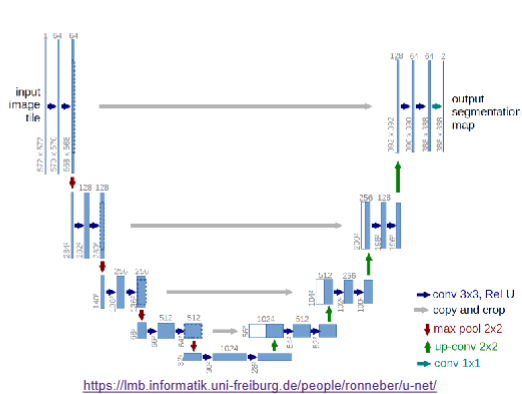
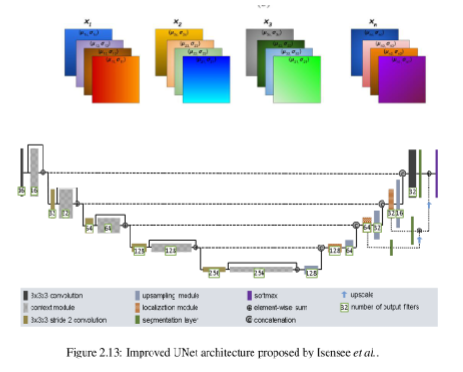

# Table of Contents
- [Improved 2D UNet](#improved-2d-unet)
  - [Problem](#problem)
  - [Model](#model)
- [Loading Data](#loading-data)
- [Training](#training)
  - [Loss](#loss)
  - [Optimiser](#optimiser)
- [Testing](#testing)
- [Result](#result)
- [References](#references)
- [Dependencies](#dependencies)

# Improved 2D UNet
A UNet is a convolutional neural network that is designed for image segmentation. This means it
classifies every pixel of an image into one of several different categories. This is particularly useful
for medical images, where you might want to classify which parts of an image correspond to certain types of tissue.

## Problem
The problem being solved is the segmentation of 2D mri images of brains, into 4 different types of brain tissue. 
The goal is for all 4 labels to have a minimum Dice similarity coefficient of 0.9 - so once the model is done training,
it could be used on any 2D mri image of a brain to accurately identify which parts of the image correspond to each type
of tissue. This could be useful for identifying potential abnormalities when scanning for illness. 

## Model
[modules.py](modules.py)

An Improved 2D UNet is similar in basic structure to a UNet. It follows the same U-Shaped architecture, where an image
is gradually reduced in spatial size while the number of channels are increased (essentially
zooming in on the image, in a way) in the encoder step. Then the feature maps are upscaled back to the original size 
of the image while maintaining the learned feature, until eventually you end up with a segmented image of the same size
as the original. UNet also utilise skip connections, where it can take the outputs from earlier levels of the encoder
and hand them directly to the decoder of the same level - this helps to reconstruct boundaries, because reducing spatial
dimensions leads to information loss.

An Improved 2D UNet has some enhancements however. Instead of the normal convolutional blocks, it use residual blocks 
with pre-activation (activation before convolution). It has optional dropout layers to avoid overfitting (unused here),
instance normalisation instead of batch normalisation (better stability with small batch sizes), and deep supervision. 
Deep supervision essentially combines the output from all the decoder layers to give the final output. This provides
better gradient flow (because it provides the gradient from all levels of the decoder, faster convergence (training 
stabilises faster which speeds it up) and improved accuracy (because we are taking outputs from all levels of the encoder,
intermediate features are more prominent, which will lead to better final predictions

# Loading Data
[dataset.py](dataset.py)
For this problem, loading the data is relatively simple. No transforms need to be applied, and the data is already
separated into images and labels, and training/testing/validation groups. All that needs to be done is to convert
each image and label to a pytorch tensor so that they can be processed by the Improved UNet.

# Training
Parameters used were as follows (these can be adjusted within train.py
Batch size: 4
Number of Epochs: 50
Learning Rate: 1e-4

## Loss
This model uses Dice similarity coefficient loss (DiceLoss). It computes the simarilty of our segmented images and
manually delineated images, based on how much they overlap. Specifically, we use Multiclass Dice loss (where we compute
the dice score for each class separately, then take the average). 
DiceLoss function was generated by AI, then adjusted based on the information from
the lecture slides.

## Optimiser
This model uses the Adam (Adaptive Moment Estimation) optimiser, which is built-in to pytorch. It works by
adjusting the learning rate for each parameter during training, by keeping track of how gradients are changing
for each weight and adjusting how much each weight is updated. It's a very common choice for deep segmentation models
such as UNet.

# Testing

# Result

# References
Lecture Slides for PNGs

# Dependencies
pytorch=2.6.0
torchvision=0.21.0
numpy=1.25.0
pillow-9.5.0
matplotlib=3.8.0
